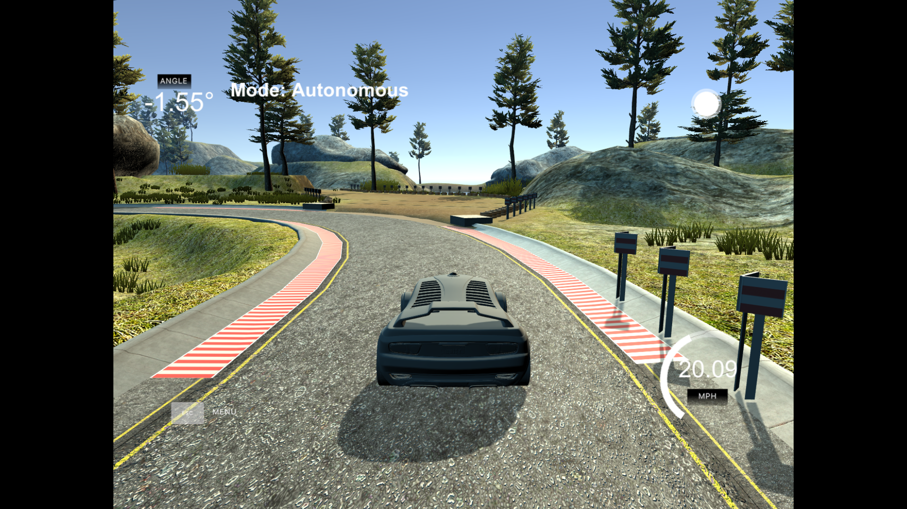
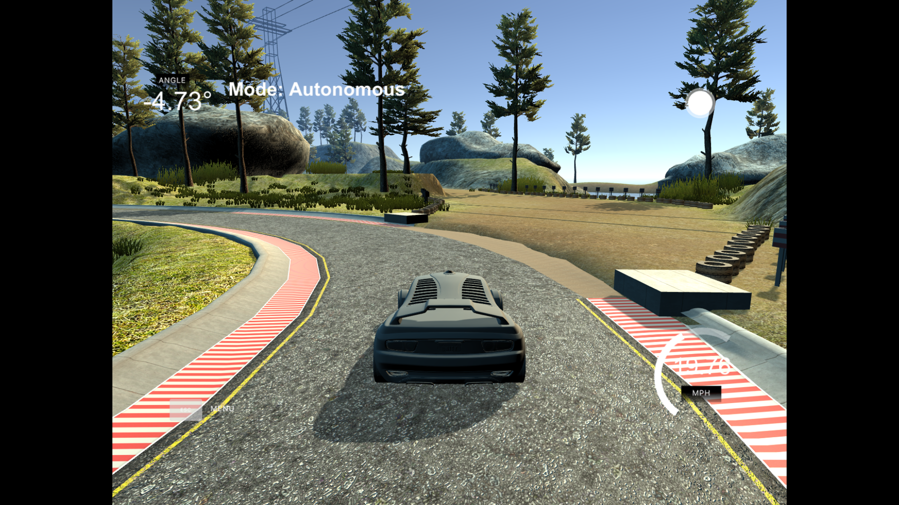
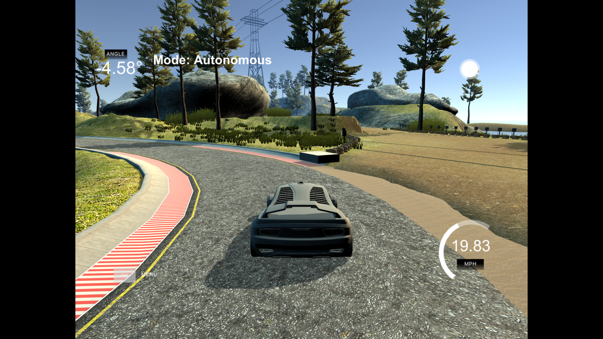
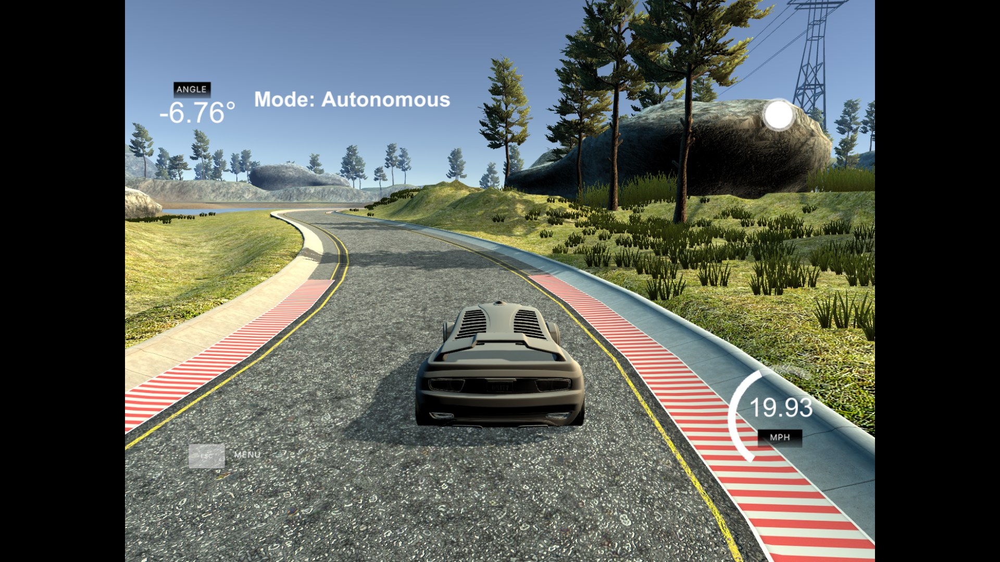
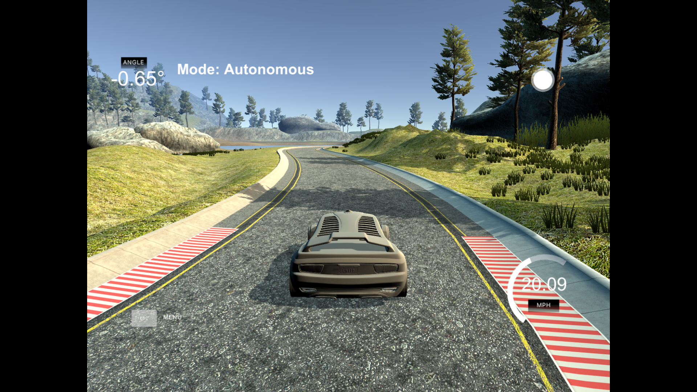
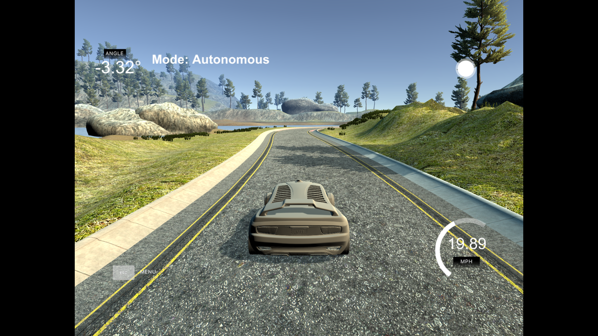

# Self driving car behavioral cloning

In this project I used a CNN to clone a car driving behavior.  
I based myself on the [Nvidia Model](https://devblogs.nvidia.com/deep-learning-self-driving-cars) and this [video](https://www.youtube.com/watch?v=EaY5QiZwSP4&feature=youtu.be).
To clone the behavior of a driving car we have steering angle associated to an image. The network then learns to predict 
the correct steering angle from an input image.

# Network Architecture

The network used is the following:

|Layers|Parameters|
|:--------:|:------------:|
|Normalization||
|Convolution2d|filters: 24, kernel size: (5,5), activation: elu|
|Convolution2d|filters: 36, kernel size: (5,5), activation: elu|
|Convolution2d|filters: 48, kernel size: (5,5), activation: elu|
|Convolution2d|filters: 64, kernel size: (5,5), activation: elu|
|Convolution2d|filters: 64, kernel size: (3,3), activation: elu|
|Droupout|rate: 0.5|
|FullyConnected|units: 100, activation: elu|
|FullyConnected|units: 50, activation: elu|
|FullyConnected|units: 10, activation: elu|
|FullyConnected|units: 1, activation: elu|

# Data preprocessing

* Images are sized to 66x200 and are converted to the YUV color space (as in the Nvidia model).
* Artifical shifts and flips are added.

# Result

For a turn during the simulation with autonomous mode:

|||
|||
|||
